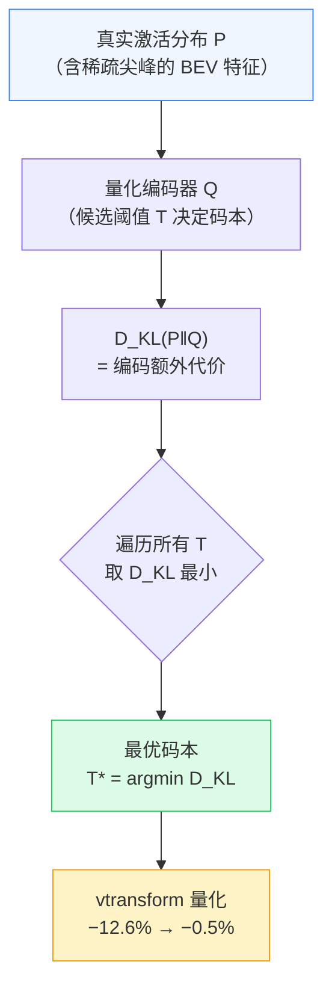
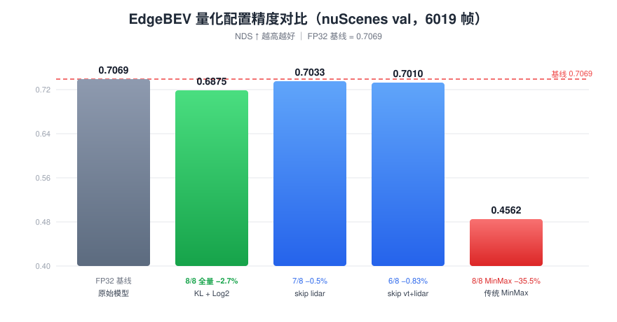
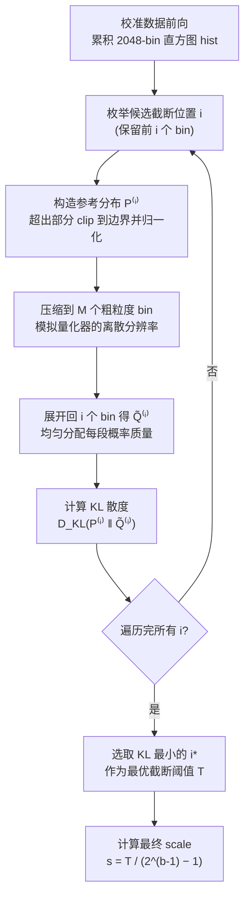
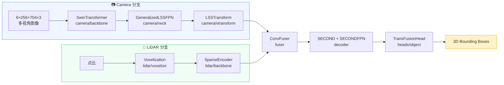
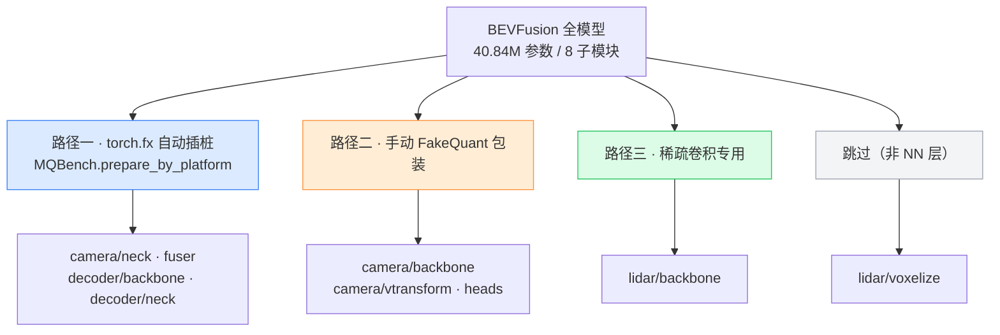
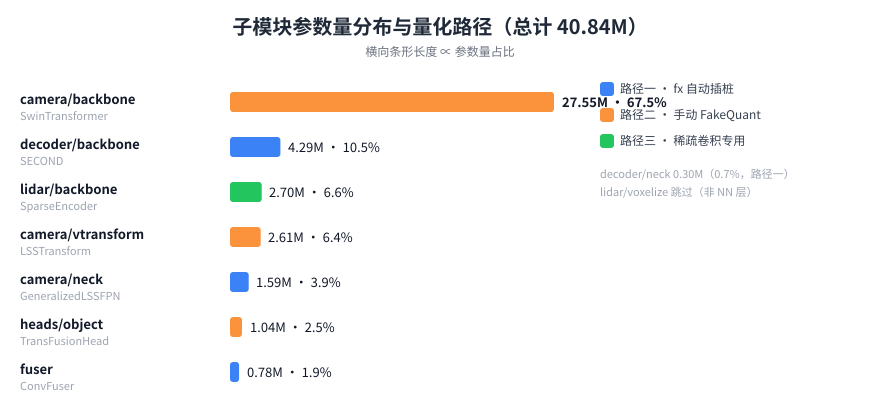
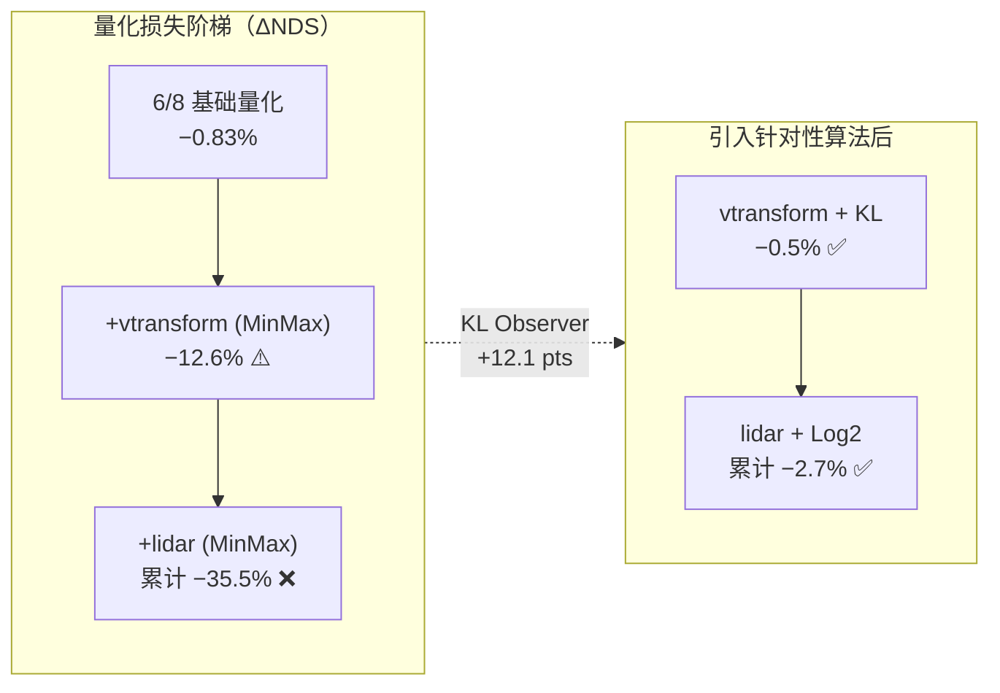
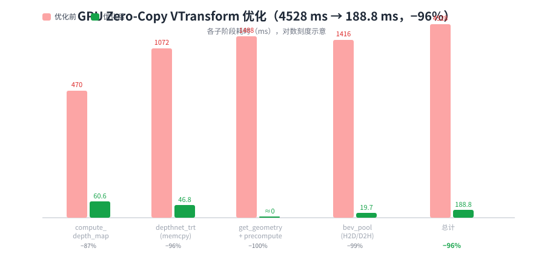

# EdgeBEV

**面向边缘部署的 BEV 感知模型 INT8 量化与 TensorRT 加速框架**

[](LICENSE)
[](#-环境要求)
[](#-环境要求)
[](#-tensorrt-部署)
[-brightgreen.svg)](#-实验结果)
[](#-部署产物规格)

> 在 nuScenes 完整验证集（6019 帧）上，将相机 + LiDAR 融合检测模型**全链路 8/8 模块**量化为 INT8，
> NDS 仅下降 **2.7%**（0.7069 → 0.6875），并将部署体积压缩至 **40%**。
> 通过 **KL Observer** 与 **Log2 对数域量化** 两项针对性算法，突破了稀疏 BEV 特征与拉普拉斯激活的量化瓶颈。
>
> 🎓 **本项目为信息论课程设计**，以 Ilya Sutskever 提出的 **"预测即压缩，压缩即智能"** 为核心思想线索——
> 将"模型量化"理解为一次**有损信源编码**，用 KL 散度（信息论中的分布距离）指导编码方案，
> 在精度约束下逼近模型的最短有效描述。详见 [设计理念](#-设计理念)。

---

## 📑 目录

- [设计理念（信息论视角）](#-设计理念)
  - [从 Kolmogorov 压缩到模型量化](#1-从-kolmogorov-压缩到模型量化)
  - [量化 = 有损信源编码](#2-量化--有损信源编码)
  - [KL 散度：信息论视角下的最优编码](#3-kl-散度信息论视角下的最优编码)
- [核心成果](#-核心成果)
- [技术原理](#-技术原理)
  - [量化基础](#1-量化基础)
  - [KL 散度校准](#2-kl-散度校准--vtransform-瓶颈)
  - [Log2 对数域量化](#3-log2-对数域量化--lidar-瓶颈)
- [系统架构](#-系统架构)
- [实验结果](#-实验结果)
- [TensorRT 部署](#-tensorrt-部署)
- [性能优化](#-性能优化)
- [快速开始](#-快速开始)
- [项目结构](#-项目结构)
- [文档索引](#-文档索引)
- [贡献与致谢](#-贡献与致谢)

---

## 🧠 设计理念

> **"预测即压缩，压缩即智能。"——Ilya Sutskever**

本项目的出发点并非"把模型压小"这一工程目标本身，而是信息论课程中一个更根本的问题：
**学习与智能的本质，是否可以理解为对数据的压缩？** 我们希望通过一个可度量、可复现的真实系统，
把这一哲学命题落地为可验证的实验。

### 1. 从 Kolmogorov 压缩到模型量化

Sutskever 指出：当我们谈论"预测下一个 token"时，本质上是在进行**信息压缩**——
一个理想的预测模型，应以**最短的程序**表示数据中的规律，这与 **Kolmogorov 复杂度**（产生某对象的最短程序长度）不谋而合。

然而 Kolmogorov 复杂度**不可计算**：不存在通用算法为任意输入寻找最短描述。
Sutskever 的洞见在于——**随机梯度下降（SGD）训练神经网络，可视为对"Kolmogorov 最优压缩"的近似搜索**。
模型规模越大、数据越丰富，其内部表示越抽象、越一般化，从而在更深层次上压缩世界。


> **本项目的定位**：如果说"训练"是把数据压缩进 FP32 模型的第一次编码，
> 那么"量化"就是**在精度约束下对模型本身进行第二次、更激进的编码**。
> 我们的目标是：用尽可能少的比特，保留尽可能多的"预测能力"——这正是**压缩即智能**的可测量形式。

### 2. 量化 = 有损信源编码

从信息论视角，一个已训练好的 FP32 模型就是一份**信源**，其"信息量"体现在它对新样本的预测能力（泛化）上。
量化则是把这个连续信源**编码为离散符号**的过程：

| 信息论概念 | 量化中的对应物 |
|-----------|--------------|
| 信源（source） | FP32 权重 / 激活张量 |
| 码字（codeword） | INT8 整数值 q |
| 码本（codebook） | 量化格点 {q·s}（均匀）或 {2^(q+β)}（对数） |
| 码率（rate） | 位宽 b = 8 bit/元素 |
| 失真（distortion） | 量化误差 &#124;x̂ − x&#124; 或导致的 NDS 下降 |
| 编码器设计目标 | **在给定码率下最小化失真**（率-失真理论） |

**率-失真（Rate–Distortion）视角**：Shannon 的理论告诉我们，给定失真上限 D，存在一个最小码率 R(D)。
本项目的实践正是这条曲线上的一个工作点——

```
失真 ↑ (NDS 损失)
   │
35%│●  MinMax 8/8（码率相同，失真灾难 —— 编码方案劣质）
   │
2.7%│              ◆ 本工作 KL+Log2 8/8（码率相同，失真极低）
   │
 0%│────────────────●─────── FP32（无失真，码率最高）
   └────────────────────────────→ 码率 (bit/元素)
        8-bit            32-bit
```

> **关键洞察**：MinMax 与本工作的**码率完全相同（都是 8-bit）**，
> 但失真相差 **13 倍**（35.5% vs 2.7%）。这说明——
> **压缩的效果不取决于"压多少"，而取决于"如何编码"**，即是否匹配信源的统计结构。

### 3. KL 散度：信息论视角下的最优编码

本项目最核心的算法（KL Observer）正是**信息论量的直接使用**。回顾 KL 散度的定义：

```text
   D_KL(P ‖ Q) = Σ_x  P(x) · log( P(x) / Q(x) )  =  H(P, Q) − H(P)
```

**信息论解读**：`D_KL(P ‖ Q)` 度量"用编码方案 Q 去编码真实信源 P 时，相对最优编码额外付出的比特数"（单位：nat/bit）。
`H(P)` 是该信源不可再压缩的**信息熵下界**，`H(P, Q)` 是实际编码的代价。因此——

```text
   min_Q  D_KL(P ‖ Q)   ⇔   min_Q  H(P, Q)   ⇔   寻找该信源的最短平均码长
```

**这正是"压缩即智能"在量化场景下的数学化身**：我们不是随意截断数值范围，而是**寻找使编码代价最小的量化方案**。
Sutskever 所说的"最短程序"，在此具体化为"使 D_KL 最小的量化阈值 T"。



### 理论到实践的四点认识

结合 Sutskever 与 Hinton 的观点，本项目在信息论课程框架下得出以下认识：

1. **学习的本质是逐步压缩**：训练从数据中提炼可泛化规律，得到紧凑的 FP32 表示；量化则是对该表示的**再压缩**，二者是同一条压缩链路的两个阶段。
2. **量化是在逼近 Kolmogorov 最优的可行近似**：既然最优压缩不可计算，我们用 SGD 训练 + 信息论指导的量化，逼近"给定比特预算下的最短有效描述"。
3. **压缩能力 ∝ 智能保留量**：MinMax 之所以失败（失真 35.5%），是因为它**无视信源统计结构**，把码字浪费在几乎无信息量的区间；KL/Log2 之所以成功，是因为它们**匹配了信源的熵结构**。
4. **跨模态的共性提炼**：相机分支（空间稀疏 → KL 截断）与 LiDAR 分支（值域稀疏 → Log2 对数）虽物理特性不同，但都通过"匹配分布"实现了高效压缩——印证了 Hinton 所说"从表面差异中提炼本质共性"。

> 📖 **推荐延伸阅读**：本项目 [docs/REPORT.md §3.5](docs/REPORT.md) 给出了 KL 校准与 Log2 量化的完整数学推导，
> 可作为信息论课程中"率-失真理论 / 交叉熵 / 信源编码"章节的**应用案例**。

---

## 🎯 核心成果

| 维度 | 指标 | 结果 |
|------|------|------|
| **量化覆盖** | 模块数 | 8/8（100% 参数，40.84M） |
| **精度** | NDS / mAP | **0.6875 / 0.6429**（FP32 基线 0.7069 / 0.6728） |
| **精度损失** | ΔNDS | **−2.7%**（MinMax 基线为 −35.5%） |
| **压缩率** | 部署体积 | 157 MB → **62.9 MB**（40%） |
| **推理加速** | vtransform | 4528 ms → **188.8 ms**（−96%） |
| **边缘部署** | 去 PyTorch | TV INT8 NDS **0.6893**（与 PyTorch INT8 完全一致） |



---

## 🔬 技术原理

> 本节从信息论与数值表示的角度，解释为什么朴素的 MinMax 量化在 BEV 模型上失效，
> 以及 KL Observer 与 Log2 量化分别如何针对性地解决 vtransform 与 lidar 的瓶颈。
>
> 参考：TensorRT `IInt8EntropyCalibrator2`、[LogNN (2016)](https://arxiv.org/pdf/1603.01025)、
> [FQ-ViT](https://arxiv.org/abs/2111.13824)、[AHCPTQ](https://arxiv.org/html/2503.03088v3)。

### 1. 量化基础

**均匀（线性）量化**将浮点值 x 映射到 b 位有符号整数域 [−2^(b−1)+1, 2^(b−1)−1]：

```text
   s = max(|x|) / (2^(b−1) − 1)
   q = clamp( round(x / s),  −2^(b−1)+1,  2^(b−1)−1 )
   x̂ = q · s
```

其中 s 为量化步长（scale），round(·) 表示四舍五入。**对称量化的关键是：步长由张量的绝对最大值决定**。这带来一个结构性缺陷——

> 若激活中存在极少数离群大值（outlier），max(|x|) 会被拉大，导致量化步长 s 变大，
> 主体分布的可用量化级别急剧减少，从而产生巨大的量化误差。

BEVFusion 的 vtransform 与 lidar 分支恰恰是这类"重尾 / 稀疏"分布的典型。

**分块（granularity）**：量化还分 *per-tensor*（整个张量共享一组 (s, z)）与 *per-channel*（每个通道独立）。
粒度越细，对通道间差异的适应性越强，但需要更多存储；本项目中 per-tensor 在 lidar 上反而更优（详见 [设计权衡](#设计权衡)）。

### 2. KL 散度校准 — vtransform 瓶颈

**问题诊断**：vtransform 的 `bev_pool` 输出 BEV 特征在空间上极度稀疏（近似 one-hot），
激活直方图在零点处形成**尖锐峰值**。用 MinMax 全范围映射时，实测 **98.3% 的 INT8 量化级别被浪费**在几乎无激活的区间。

**解决思路**：不等价地"相信最大值"，而是**主动截断**到区间 [−T, T]，并通过最小化量化前后分布的
KL 散度来选择最优的 T。这正是 TensorRT `IInt8EntropyCalibrator2` 的思想。

**算法流程**（对一个张量的 2048-bin 直方图）：



参考分布 P^(i)（截断 + 边界 clip）与量化重分布 Q̃^(i)（粗量化后均匀展开）定义为：

```text
              ┌ hist[j],                0 <= j < i-1
   P_j^(i) = ─┤
              └ Σ_{t=i-1..N-1} hist[t],  j = i-1

   Q̃_j^(i) = ( 1 / L_k ) · Σ_{t=start_k..end_k} P_t^(i),   k = floor( j·M / i )
```

其中将 [0, i-1] 均匀划分为 M 个粗粒度 bin，L_k = end_k - start_k + 1。最终选取

```text
   i* = argmin_{i ∈ [M, N]}  D_KL( P^(i) ‖ Q̃^(i) )
   T  = bin_width · i*
```

**为什么有效**：它直接优化"量化后分布"与"真实分布"的信息损失，而非盲目覆盖极值。
截断掉的是对分布形态贡献极小的尾部，却为主体换回了大量可用量化级别。

**实测效果**：vtransform 量化损失从 **−12.6% 收敛到 −0.5%（+12.1 pts）**。

### 3. Log2 对数域量化 — lidar 瓶颈

**问题诊断**：lidar 稀疏激活经 BN+ReLU 后服从**零均值拉普拉斯分布**——绝大多数激活为 0，
非零值集中在零点附近。均匀量化在零点附近步长恒定，导致**小幅值信号的相对误差极大**
（可超过 100%），而有值区域精度又不足。先用 W8A16 控制实验确认了瓶颈在**激活**而非权重：

| 实验 | 激活精度 | NDS | ΔNDS |
|------|---------|-----|------|
| 7/8 + lidar EMA | INT8 | 0.5751 | −18.5% |
| **7/8 + lidar W8A16** | FP（不量化激活） | **0.7009** | **−0.85%** |

结论：**激活量化是 lidar 损失的根本来源**（−18.5% vs −0.85%），权重 int8 几乎无损。解决方案必须变革**激活的量化方式**。

**解决思路**：改用**对数域量化**，使相邻量化格点在以 2 为底的指数域上均匀，从而获得近似**恒定的相对误差**：

```text
   q = clamp( round( log2(|x|) − β ),  −127,  127 )
   x̂ = sign(x) · 2^( q + β )
```

其中 β 是对数域基准（base），由校准数据非零激活分布的**低百分位**（默认第 5 百分位）估计，使动态范围对齐 INT8 格点。
零值通过阈值 ε 精确还原：

```text
          ┌ 0,                    |x| < ε
   x̂  = ─┤
          └ sign(x) · 2^(q+β),    otherwise
```

**相对误差对比**：

| 量化方式 | 相邻格点关系 | 相对误差 | 适用分布 |
|---------|------------|---------|---------|
| 均匀 INT8 | 绝对步长恒定 | 小幅值处 **≫ 100%** | 均匀 / 高斯 |
| **Log2** | 相邻格点比例恒为 2 | **恒定 ≈ 41%** | 幂律 / 拉普拉斯 |

> **数学直觉**：均匀量化保证 |x̂ − x| ≤ s/2（绝对误差有界），
> 但对 x → 0 相对误差发散；对数量化则保证 |x̂/x − 1| ≤ 1 − 1/√2 量级（相对误差有界），
> 恰好匹配稀疏激活"小值密集、大值稀少"的物理分布。

**实测效果**：lidar 量化损失从 **−18.5% 收敛到 −3.1%（+15.4 pts）**。

### 设计权衡

**① 为何选 KL 而非 MSE？** vtransform 的瓶颈是"空间稀疏导致动态范围浪费"，本质是**分布形态不匹配**。
KL 直接度量分布层面的信息损失，与目的同构；MSE 度量的是逐点欧氏距离，对长尾尾部仍敏感，无法解决"级别浪费"。

**② 为何 lidar 用 per-tensor 而非 per-channel？** 实验显示 PT −3.1% 优于 PC −4.9%。
在本项目 ~128 batch 的小校准集下，per-channel 需要估计的参数（21 层 × C 通道）远超数据支撑能力，
**容易过拟合校准分布**。这印证了量化中"粒度越细 ≠ 一定越好"的权衡。

**③ 为何 Log2 而非其他非线性量化？** Log2 的格点比例恒为 2，可实现为**简单的移位/指数运算**，硬件友好；
同时与稀疏激活的幂律/拉普拉斯特性天然契合。相较 Tan 量化器等方案，Log2 更契合 lidar 的零均值重尾分布。

---

## 🏗️ 系统架构

### 端到端推理管线



### 三条量化路径（为何需要）

> 传统 PTQ 假设模型可整体导出为 ONNX 后统一校准。BEVFusion 是**异构多模态模型**，存在三类障碍：
> 稀疏卷积（spconv）无 ONNX 算子、`bev_pool` 是自定义 CUDA autograd Function、
> SwinTransformer 内部存在基于张量值的动态控制流。因此必须**分而治之**。





### 数据流与精度边界（ASCII 框图）

```
 阶段        输入                算子                    精度边界
 ─────────────────────────────────────────────────────────────────────────────────
 Camera     6×3×256×704   →  SwinTransformer (INT8)  →  conv/attn 全 INT8
            4 尺度特征     →  GeneralizedLSSFPN(INT8) →  conv/BN 全 INT8
            depth 分布     →  LSSTransform (INT8)     →  depthnet INT8 + bev_pool FP32
                                │
                                ▼  [N,C,D,H,W] BEV 特征（空间极稀疏 → KL 截断）
 LiDAR      点云 (~34k 点) →  Voxelization (FP32)    →  非 NN，跳过
            体素网格       →  SparseEncoder (INT8)    →  稀疏卷积 + Log2 激活量化
                                │                    （零均值拉普拉斯 → 对数域）
                                ▼  [N,C,D,H,W] BEV 特征
 ─────────────────────────────────────────────────────────────────────────────────
 Fusion     cat(cam, lidar) →  ConvFuser (INT8)      →  Conv2d + BN + ReLU
 Decode     fused BEV      →  SECOND (INT8)          →  多层 Conv2d
                           →  SECONDFPN (INT8)       →  ConvTranspose2d
 Head       decoder 特征    →  TransFusionHead (INT8) →  Attention + TopK
                           →  3D BBox（NMS 全 FP32）
```

---

## 📊 实验结果

### 量化精度（nuScenes val，6019 帧）

| 配置 | 量化模块 | NDS | mAP | ΔNDS | 关键算法 |
|------|:--------:|-----|-----|------|---------|
| **FP32 基线** | 0/8 | **0.7069** | **0.6728** | — | 原始模型 |
| **8/8 全量化（最终）** | **8/8** | **0.6875** | **0.6429** | **−2.7%** | vtransform KL + lidar Log2 |
| 7/8 全量化 | 7/8 | 0.7033 | 0.6657 | −0.5% | vtransform KL（skip lidar） |
| 6/8 基础 PTQ | 6/8 | 0.7010 | 0.6614 | −0.83% | 8/8 消融中间态 |
| 8/8 MinMax 基线 | 8/8 | 0.4562 | 0.3536 | −35.5% | 传统 MinMax |

### 瓶颈定位与突破（消融实验）



| 瓶颈模块 | 根因 | 解决方案 | 改善 |
|---------|------|---------|------|
| **vtransform** | bev_pool 输出空间极稀疏，直方图零点尖峰，**98.3% range waste** | KL 散度最优截断校准 | −12.6% → **−0.5%**（+12.1 pts） |
| **lidar/backbone** | 稀疏激活呈零均值拉普拉斯分布，线性量化零点附近浪费 | **Log2 对数域量化** | −18.5% → **−3.1%**（+15.4 pts） |
| **组合效果** | 两瓶颈叠加导致 8/8 崩溃 | KL + Log2 联合 | −35.5% → **−2.7%** |

### 部署精度（独立部署环境验证）

| 路径 | LiDAR 实现 | 量化 | NDS | mAP | 状态 |
|------|-----------|:----:|-----|-----|:----:|
| PyTorch FP16 | `SparseEncoder23` | — | 0.7040 | 0.6654 | ✅ |
| **TV FP16** | `TVSparseEncoder`（去 PyTorch） | — | **0.7039** | — | ✅ |
| PyTorch INT8 | `SparseEncoder23` | Log2 | **0.6893** | 0.6478 | ✅ |
| **TV INT8** | `TVSparseEncoder`（去 PyTorch） | Log2 | **0.6893** | 0.6474 | ✅ |

> **关键结论**：TV INT8 与 PyTorch INT8 的 NDS **完全一致**（0.6893），mAP 差异仅 0.0004（INT8 kernel 实现差异导致的正常 rounding 波动）。
> 这证明 **Log2 量化不仅在 PyTorch 仿真中有效，在完全去 PyTorch 的部署链路中也保持精度**。

---

## 🚀 TensorRT 部署

### 三条推理路径

| 路径 | 入口脚本 | 核心特征 | 运行环境 |
|------|---------|---------|---------|
| **Hybrid** | `tools/trt_infer.py` | PyTorch + TRT 混合；vtransform 走原生 PyTorch GPU | `edgebev_research` |
| **Standalone** | `tools/trt_infer_standalone.py` | 同 Hybrid，LiDAR 换 spconv 2.3 / TV，内联 mmcv/mmdet3d 依赖 | `spconv23_deploy` |
| **Zero-Torch** | `tools/trt_infer_zero_torch.py` | **完全零 PyTorch**：ctypes + 纯 CUDA/C++ 调用 TRT 引擎 | `edgebev_research` |

### 部署产物规格

| 组成 | 大小 | 说明 |
|------|------|------|
| 5× TRT INT8 引擎 | 57.3 MB | SwinT 33 + Neck 1.8 + Depthnet 1.7 + Fuser/Decoder 17 + Head 3.8 |
| Zero-Torch CUDA 扩展 | ~2.7 MB | vtransform_gpu + bev_pool + iou3d + voxel_layer |
| LiDAR 权重 (INT8 `.npy`) | 2.9 MB | TVSparseEncoder 零 PyTorch 加载 |
| **总部署体积** | **~62.9 MB** | 原始 FP32 模型 157 MB（**压缩至 40%**） |

### 自定义 TensorRT Plugin

| Plugin | 功能 | 位置 |
|--------|------|------|
| `BEVPoolV2` | BEV 池化（interval-sum kernel） | `tools/trt_plugins/bev_pool_v2/` |
| `SparseLog2Quant` | 对数域稀疏量化 | `tools/trt_plugins/sparse_log2_quant/` |

---

## ⚡ 性能优化

### GPU Zero-Copy VTransform

vtransform 阶段（`compute_depth_map → depthnet → get_geometry → precompute_bev_indices → bev_pool`）
原全部在 CPU 执行，且存在多次 GPU↔CPU 搬运，单样本耗时高达 **4528 ms**，占端到端 **85%+**。



| 子阶段 | 优化前 (ms) | 优化后 (ms) | 降幅 | 优化手段 |
|--------|:-----------:|:-----------:|:----:|---------|
| `compute_depth_map` | 470 | 60.6 | −87% | Python 循环 → CUDA kernel |
| `depthnet_trt` (含 memcpy) | 1072 | 46.8 | −96% | `return_gpu_buffers=True`，消除 80MB D2H |
| `get_geometry` | 559 | ≈0（合并） | −100% | numpy CPU → CUDA kernel |
| `precompute_bev_indices` | 929 | ≈0（合并） | −100% | numpy `argsort` → Thrust `sort_by_key` |
| `bev_pool_v2` | 1416 | 19.7 | −99% | H2D/D2H 消除 + transpose 上 GPU |
| **VTransform 总计** | **4528** | **188.8** | **−96%** | — |

**零拷贝链路**：depth map on GPU → depthnet TRT GPU in/out → geometry + bev_pool + transpose 全 GPU 一次完成，无 D2H。

---

## 🏁 快速开始

### 环境要求

| 组件 | 研究环境 | 部署环境 |
|------|---------|---------|
| Python | 3.8 | 3.9 |
| PyTorch | 1.10.2 + cu113 | 2.0 |
| CUDA | 11.3 | 11.8+ |
| 关键依赖 | `mmcv-full==1.4.0`, `mmdet==2.20.0`, `mqbench==0.0.6` | `spconv 2.3`, TensorRT 10.x |

### 安装

```bash
# 1. 安装 PyTorch（研究环境）
pip install torch==1.10.2+cu113 torchvision==0.11.3+cu113 \
    -f https://download.pytorch.org/whl/torch_stable.html

# 2. 安装框架依赖
pip install mmcv-full==1.4.0 mmdet==2.20.0 mqbench==0.0.6

# 3. 安装本项目
python setup.py develop
```

### 数据集

- [nuScenes v1.0-trainval](https://www.nuscenes.org/download)（6019 验证帧）
- 预训练权重：可自行从上游 BEVFusion 官方发布获取

### 典型工作流

```bash
CFG=configs/nuscenes/det/transfusion/secfpn/camera+lidar/swint_v0p075/convfuser.yaml
CKPT=pretrained/bevfusion-det.pth

# ① FP32 基线评估（期望 NDS 0.7069）
python tools/test.py $CFG $CKPT --eval bbox

# ② PTQ 8/8 全量化（KL + Log2，期望 NDS 0.6875）
python tools/quant_ptq_minmax.py $CFG --load-from $CKPT \
    --vtransform-observer kl_divergence \
    --act-observer log2 --sparse-act-mode per_tensor \
    --calib-batches 128

# ③ Standalone TRT 端到端推理
python tools/trt_infer_standalone.py --engine-dir ./
```

> 完整命令（含消融、Zero-Torch 验证、Orin 部署）见 [docs/COMMANDS.md](docs/COMMANDS.md)。

---

## 📁 项目结构

```
EdgeBEV/
├── tools/                           # 核心工具
│   ├── quant_ptq_minmax.py          # ⭐ PTQ 量化（MinMax / KL / Log2）
│   ├── trt_infer.py                 # Hybrid TRT + PyTorch 推理
│   ├── trt_infer_standalone.py      # Standalone 推理（spconv 2.3）
│   ├── trt_infer_zero_torch.py      # Zero-Torch 推理（无 PyTorch）
│   ├── tv_sparse_encoder.py         # TVSparseEncoder（去 PyTorch LiDAR backbone）
│   ├── tv_allocator.py              # TVAllocator + cuBLAS GEMM wrapper
│   ├── validate_e2e_zero_torch.py   # Zero-Torch vs Hybrid 数值一致性验证
│   ├── quant_ptq_brecq.py           # BRECQ 权重量化对照实验
│   ├── export_utils/                # ONNX 导出 / TRT 构建
│   ├── trt_plugins/                 # 自定义 TRT Plugin（C++/CUDA）
│   └── zero_torch_ops/              # 纯 CUDA/C++ 算子（无 torch 依赖）
├── mmdet3d/                         # 模型与数据管线（fx 追踪兼容化修改）
├── configs/                         # 模型配置
├── assets/                          # 文档图表（SVG）
├── docs/                            # 技术文档（见下方索引）
├── pretrained/                      # 预训练 / 量化权重
├── build/  build_deploy/            # CUDA 扩展编译产物
└── tests/                           # 回归测试
```

---

## 📚 文档索引

| 文档 | 内容 | 适合 |
|------|------|------|
| [docs/HANDOFF_MASTER.md](docs/HANDOFF_MASTER.md) | ⭐ 总交接文档（单一入口，架构 + 双环境 + 命令速查） | 新接手者 |
| [docs/REPORT.md](docs/REPORT.md) | 完整技术报告（量化原理、实现、实验、部署） | 深入理解 |
| [docs/COMMANDS.md](docs/COMMANDS.md) | 全部可运行命令速查 | 复现实验 |
| [docs/ablation.md](docs/ablation.md) | 消融实验设计与结果分析 | 调优参考 |
| [docs/RESULTS_LOG.md](docs/RESULTS_LOG.md) | 实验结果时间线 | 追溯历史 |
| [docs/SERVER_DEPLOY.md](docs/SERVER_DEPLOY.md) | 远程服务器部署参考示例 | 部署 |
| [docs/archive/](docs/archive/) | Phase 1–9 历史交接归档 | 历史追溯 |

---

## 🤝 贡献与致谢

本项目建立在上游开源工作之上，特此致谢：

- **BEVFusion** — 多模态 3D 检测基线：[论文](https://arxiv.org/abs/2205.13542) · [代码](https://github.com/mit-han-lab/bevfusion)
- **MQBench** — 量化算法库：[代码](https://github.com/ModelTC/MQBench) · [文档](https://mqbench.readthedocs.io/)
- **mmdetection3d** — 3D 检测框架：[代码](https://github.com/open-mmlab/mmdetection3d)
- **TensorRT** — 推理优化后端：[文档](https://docs.nvidia.com/deeplearning/tensorrt/)

---

## 📄 许可证

本项目遵循 [Apache 2.0 许可证](LICENSE)。

---

<div align="center">

**EdgeBEV** · 后量化研究 + TensorRT 边缘部署

`8/8 INT8` · `NDS 0.6875 (−2.7%)` · `62.9 MB` · `vtransform −96%`

</div>
