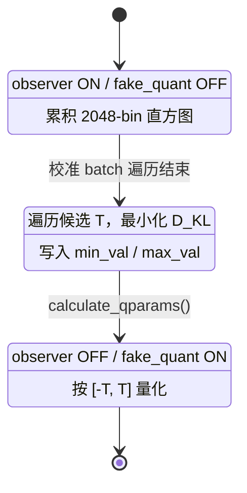
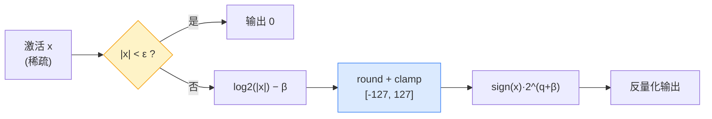

# EdgeBEV 技术报告：BEV 感知模型全模型 INT8 量化与 TensorRT 部署

> **项目**：EdgeBEV 训练后量化（PTQ）
> **硬件**：NVIDIA RTX 4060 Laptop GPU（Ada Lovelace，Compute 8.9）
> **框架**：PyTorch 1.10.2 + CUDA 11.3 + MQBench 0.0.6

| 关键指标 | 结果 |
|---------|------|
| 量化覆盖 | 8/8 模块 · 40.84M 参数 |
| 精度 | NDS 0.6875 / mAP 0.6429（FP32 基线 0.7069 / 0.6728） |
| 精度损失 | **−2.7%**（MinMax 基线 −35.5%） |
| 部署体积 | 157 MB → **62.9 MB** |

---

## 目录

1. [概述](#1-概述)
2. [BEVFusion 模型架构分析](#2-bevfusion-模型架构分析)
3. [量化策略与实现](#3-量化策略与实现)
   - [3.5 量化数学推导](#35-量化数学推导)
   - [3.6 两条针对性算法的实现机制](#36-两条针对性算法的实现机制)
   - [3.7 设计权衡分析](#37-设计权衡分析)
4. [量化实验](#4-量化实验)
   - [4.1 瓶颈定位：6/8 消融实验](#41-瓶颈定位68-消融实验)
   - [4.2 KL Observer 解决 vtransform 瓶颈](#42-kl-observer-解决-vtransform-瓶颈)
   - [4.3 Log2 对数域量化解决 lidar 瓶颈](#43-log2-对数域量化解决-lidar-瓶颈)
   - [4.4 实验总结](#44-实验总结)
5. [最终结果汇总](#5-最终结果汇总)
6. [TensorRT 部署验证](#6-tensorrt-部署验证)
   - [6.1 部署架构与三条推理路径](#61-部署架构与三条推理路径)
   - [6.2 各阶段部署成果](#62-各阶段部署成果)
   - [6.3 部署产物规格](#63-部署产物规格)
   - [6.4 GPU Zero-Copy VTransform 优化](#64-gpu-zero-copy-vtransform-优化)
   - [6.5 Zero-Torch 链路迭代](#65-zero-torch-链路迭代)
   - [6.6 性能问题排查案例](#66-性能问题排查案例)
7. [部署阶段教训与反思](#7-部署阶段教训与反思)
8. [结论](#8-结论)

---

## 1. 概述

BEVFusion 是一种多模态 3D 目标检测模型，融合摄像头和激光雷达信息生成 BEV（鸟瞰图）表示。本项目基于 [MQBench](https://github.com/ModelTC/MQBench) 量化工具库，对 BEVFusion 实施**训练后量化（PTQ）**，目标后端为 NVIDIA TensorRT INT8。

核心挑战在于：BEVFusion 是一个**异构多模态模型**，包含稀疏卷积、自定义 CUDA 算子、Transformer 等多种子模块，无法对全模型统一量化。我们设计了**三条选择性量化路径**，最终实现了 **8/8 全模块 INT8 量化**，精度损失仅 **−2.7%**。

### 1.1 信息论课程设计背景

本项目为**信息论课程设计**，其理论线索来自 Ilya Sutskever 提出的 **"预测即压缩，压缩即智能"**：

> 当我们谈论"预测下一个 token"时，本质上是在进行**信息压缩**。一个理想的预测模型，应以最短的程序
> 表示输入数据中的规律——这与 **Kolmogorov 复杂度**（产生某对象的最短程序长度）不谋而合。
> 虽然 Kolmogorov 最优压缩不可计算，但 **SGD 训练神经网络可视为对其的近似搜索**。

本工作把这一思想具体化为一个可度量的实验命题：**把"模型量化"理解为一轮有损信源编码**，
并在精度约束下寻找使编码代价（失真）最小的量化方案。我们据此提出两个直接对应信息论量的算法：

| 算法 | 信息论工具 | 对应问题 | 效果 |
|------|-----------|---------|------|
| **KL Observer** | 交叉熵 / KL 散度 | 为 vtransform 稀疏分布寻找**最短平均码长**的量化码本 | −12.6% → −0.5% |
| **Log2 量化** | 率-失真 / 熵匹配 | 为 lidar 拉普拉斯激活设计**相对误差有界**的非均匀码本 | −18.5% → −3.1% |

**核心洞察**：MinMax 与 KL+Log2 的**码率完全相同（均为 8 bit/元素）**，但失真相差 **13 倍**
（35.5% vs 2.7%）。这印证了信息论的基本观点——**压缩质量取决于编码方案是否匹配信源的统计结构，
而非压缩率本身**。完整推导见 [§3.5 量化数学推导](#35-量化数学推导)，理论展开见仓库根目录 [README.md 设计理念](../README.md#-设计理念)。

Hinton 亦从另一角度指出：AI 系统的理解、类比与创新，关键在于**发现并利用不同事物之间的共同结构**——
即从表面差异中提炼最本质的共性。本项目两条量化路径（相机分支的空间稀疏、LiDAR 分支的值域稀疏）
虽物理特性迥异，却都通过"匹配分布"实现了高效压缩，为这一观点提供了一个具象的工程注脚。

---

## 2. BEVFusion 模型架构分析

BEVFusion 的推理管线可以分为以下几个阶段：

```
输入                     特征提取                  BEV 投影         融合       解码       检测
─────────────────────────────────────────────────────────────────────────────────────────────
多视角图像 ─→ SwinTransformer ─→ GeneralizedLSSFPN ─→ bev_pool ─┐
    (6×256×704×3)   camera/backbone    camera/neck      camera/vtransform  │
                                                                           ├→ ConvFuser ─→ SECOND ─→ SECONDFPN ─→ TransFusionHead ─→ 3D Bbox
                                                                           │     fuser    decoder/   decoder/     heads/object
点云 ─→ Voxelization ─→ SparseEncoder ─────────────────────────────────────┘    backbone    neck
         lidar/voxelize  lidar/backbone
```

### 各子模块的计算特性

| 子模块              | 类                | 算子类型                               | 量化路径       |
| ------------------- | ----------------- | -------------------------------------- | -------------- |
| `camera/backbone`   | SwinTransformer   | Attention + MLP + Window Partition     | 路径二（手动） |
| `camera/neck`       | GeneralizedLSSFPN | Conv2d + BN + ReLU + Bilinear Upsample | 路径一（fx）   |
| `camera/vtransform` | LSSTransform      | 自定义 CUDA 算子 (QuickCumsumCuda)     | 路径二（手动） |
| `lidar/voxelize`    | Voxelization      | 动态分散 (scatter)，非神经网络层       | 跳过（非 NN）  |
| `lidar/backbone`    | SparseEncoder     | 稀疏卷积 (spconv)                      | 路径三（稀疏） |
| `fuser`             | ConvFuser         | Conv2d(336,256,3) + BN + ReLU          | 路径一（fx）   |
| `decoder/backbone`  | SECOND            | 多层 Conv2d + BN + ReLU                | 路径一（fx）   |
| `decoder/neck`      | SECONDFPN         | ConvTranspose2d + BN + ReLU            | 路径一（fx）   |
| `heads/object`      | TransFusionHead   | Attention + TopK + 动态 shape          | 路径二（手动） |

### 各子模块的参数分布

| 子模块                              | 参数量     | FP32 权重大小 | 占比     |
| ----------------------------------- | ---------- | ------------- | -------- |
| `camera/backbone` (SwinTransformer) | 27.55M     | 105.20 MB     | 67.5%    |
| `lidar/backbone` (SparseEncoder)    | 2.70M      | 10.29 MB      | 6.6%     |
| `camera/vtransform` (LSSTransform)  | 2.61M      | 9.95 MB       | 6.4%     |
| `decoder/backbone` (SECOND)         | 4.29M      | 16.35 MB      | 10.5%    |
| `camera/neck` (GeneralizedLSSFPN)   | 1.59M      | 6.08 MB       | 3.9%     |
| `heads/object` (TransFusionHead)    | 1.04M      | 3.95 MB       | 2.5%     |
| `fuser` (ConvFuser)                 | 0.78M      | 2.95 MB       | 1.9%     |
| `decoder/neck` (SECONDFPN)          | 0.30M      | 1.13 MB       | 0.7%     |
| **总计**                            | **40.84M** | **155.91 MB** | **100%** |

---

## 3. 量化策略与实现

### 3.1 为什么需要三条量化路径

传统 PTQ 工具假设模型可被完整导出为 ONNX，再统一做 INT8 校准。BEVFusion 存在以下障碍：

1. **稀疏卷积（spconv）**：LiDAR 分支的 SparseEncoder 使用稀疏张量表示，标准 ONNX 和 TensorRT 均不支持。
2. **自定义 CUDA 算子**：Camera 分支的 `bev_pool`（QuickCumsumCuda）是用 CUDA C++ 实现的 autograd Function，没有对应的 ONNX 算子。
3. **动态控制流**：SwinTransformer 内部有 `if x.shape[0] > window_size:` 等基于张量值的分支判断，`torch.fx` 符号追踪时会失败。TransFusionHead 中的动态迭代同样不兼容。
4. **体素化预处理**：Voxelization 是离散化预处理步骤，不包含可微分的权重，不需要量化。

### 3.2 三条量化路径

| 路径                              | 适用模块                                           | 方法                          |
| --------------------------------- | -------------------------------------------------- | ----------------------------- |
| **路径一**（torch.fx 自动插桩）   | camera/neck, fuser, decoder/backbone, decoder/neck | `MQBench.prepare_by_platform` |
| **路径二**（手动 FakeQuant 包装） | camera/backbone, camera/vtransform, heads          | 手动替换 Conv2d/Linear        |
| **路径三**（稀疏卷积专用）        | lidar/backbone                                     | 手动替换 SparseConvolution    |

**设计跳过**：`lidar/voxelize`（体素化预处理，非神经网络层）

### 3.3 核心工具脚本

| 脚本                        | 功能                                         |
| --------------------------- | -------------------------------------------- |
| `tools/quant_ptq_minmax.py` | **核心 PTQ 工具**（MinMax/KL Observer/Log2） |
| `tools/test.py`             | FP32 基线评估                                |
| `tools/quant_benchmark.py`  | 性能基准测试                                 |

### 3.4 mmdet3d 代码修改

为支持 `torch.fx` 符号追踪，对以下模型文件进行了最小化修改：

#### `mmdet3d/models/necks/second.py`（SECONDFPN）

```python
# 修改前（fx 追踪失败：len(x) 在 Proxy 上不可用）
def forward(self, x):
    assert len(x) == len(self.in_channels)
    ups = [deblock(x[i]) for i, deblock in enumerate(self.deblocks)]
    ...

# 修改后
def forward(self, x):
    # 移除了 assert len(x) == len(self.in_channels) 断言
    ups = [deblock(x[i]) for i, deblock in enumerate(self.deblocks)]
    ...
```

#### `mmdet3d/models/necks/generalized_lss.py`（GeneralizedLSSFPN）

```python
# 修改前（fx 追踪失败：len(inputs) 在 Proxy 上不可用）
def forward(self, inputs):
    assert len(inputs) == len(self.in_channels)
    laterals = [inputs[i + self.start_level] for i in range(len(inputs))]
    ...

# 修改后
def forward(self, inputs):
    # 使用 self.num_ins（__init__ 中预计算的常量）替代 len(inputs)
    laterals = [inputs[i + self.start_level] for i in range(self.num_ins)]
    ...
```

#### `mmdet3d/models/fusers/conv.py`（ConvFuser）

```python
# 修改前（fx 追踪失败：torch.cat(Proxy, dim=1) 中 Proxy 代表整个 list）
def forward(self, inputs):
    return super().forward(torch.cat(inputs, dim=1))

# 修改后
def forward(self, inputs):
    # 通过 __getitem__ 索引让 fx 看到独立的 Proxy 对象
    return super().forward(torch.cat([inputs[i] for i in range(len(self.in_channels))], dim=1))
```

**修改原则**：

- 最小化改动，不改变运行时行为
- 仅消除 `torch.fx` 追踪时的动态控制流
- 用 `__init__` 中的常量替代运行时的 `len()` 调用

---

### 3.5 量化数学推导

本节给出报告中两项核心算法的完整数学形式。符号约定：$x$ 为浮点激活，$\hat{x}$ 为反量化后的近似值，$b$ 为位宽（本工作 $b=8$）。

#### 3.5.1 均匀量化的误差结构

对称均匀量化将浮点值映射到整数域 $[-2^{b-1}+1,\ 2^{b-1}-1]$：

$$
s = \frac{\max(|x|)}{2^{b-1}-1}, \qquad
q = \operatorname{clamp}\!\Big(\big\lfloor \tfrac{x}{s} \big\rceil,\ -2^{b-1}+1,\ 2^{b-1}-1\Big), \qquad
\hat{x} = q \cdot s
$$

其**绝对误差有上界** $|\hat{x} - x| \le s/2$，与 $x$ 的取值无关。但**相对误差**为

$$
\frac{|\hat{x} - x|}{|x|} \le \frac{s/2}{|x|} \xrightarrow[\;|x|\to 0\;]{} \infty
$$

即：均匀量化在零点附近相对误差发散。对于零均值拉普拉斯分布的稀疏激活（大部分值趋近 0），这意味着**大量小值信息的相对损失极大**。此外，$s \propto \max(|x|)$ 表明单个离群值会立刻放大步长、压缩主体的可用级别——这正是 vtransform 出现 98.3% range waste 的数学根因。

#### 3.5.2 KL 散度校准的推导

设校准得到的 $N$-bin 直方图为 $\text{hist}$。对候选截断位置 $i$（保留前 $i$ 个 bin），先构造**截断参考分布** $P^{(i)}$——把超出阈值的概率质量 clip 到边界 bin：

$$
P_j^{(i)} =
\begin{cases}
\text{hist}[j], & 0 \le j < i-1 \\[4pt]
\displaystyle\sum_{t=i-1}^{N-1} \text{hist}[t], & j = i-1
\end{cases}
$$

再模拟量化器的**粗粒度分辨率**：将 $[0, i-1]$ 均匀划分为 $M = 2^{b-1}$ 段，第 $k$ 段覆盖
$[\text{start}_k, \text{end}_k] = [\lfloor k\,i/M \rfloor,\ \lfloor (k+1)i/M \rfloor - 1]$，段长 $L_k = \text{end}_k - \text{start}_k + 1$。
把每段概率质量**均匀展开**回细粒度 bin，得到重分布：

$$
\tilde{Q}_j^{(i)} = \frac{1}{L_k}\sum_{t=\text{start}_k}^{\text{end}_k} P_t^{(i)},
\qquad k = \Big\lfloor \frac{j\,M}{i} \Big\rfloor
$$

最后在所有候选 $i$ 中选取使 KL 散度最小者：

$$
i^\* = \arg\min_{i \in [M,\,N]} \sum_{j=0}^{i-1} P_j^{(i)} \log \frac{P_j^{(i)}}{\tilde{Q}_j^{(i)}}
= \arg\min_{i}\ D_{\mathrm{KL}}\!\big(P^{(i)} \,\|\, \tilde{Q}^{(i)}\big),
\qquad T = \text{bin\_width} \cdot i^\*
$$

之后以 $T$ 替代 $\max(|x|)$ 计算 $s$。**语义**：$D_{\mathrm{KL}}$ 度量"用量化后分布 $\tilde{Q}$ 近似真实分布 $P$ 所付出的额外信息代价"，最小化它等价于寻找在量化分辨率约束下信息保真度最高的截断点。

#### 3.5.3 Log2 对数域量化的误差结构

将量化在**对数域**进行，令相邻格点在以 2 为底的指数域上等距：

$$
q = \operatorname{clamp}\!\Big(\big\lfloor \log_2(|x|) - \beta \big\rceil,\ -2^{b-1}+1,\ 2^{b-1}-1\Big),
\qquad
\hat{x} = \operatorname{sign}(x)\cdot 2^{\,q + \beta}
$$

其中基准 $\beta$ 由非零激活的 $p$-分位数（本工作 $p=0.05$）估计，使有效动态范围对齐整数格点：

$$
\beta = \operatorname{quantile}_{p}\big(\{\log_2|x_i| : |x_i| > \varepsilon\}\big)
$$

**相对误差有界性**：设 $q^\* = \log_2|x| - \beta$ 为未取整的理想值。因 $\lfloor \cdot \rceil$ 的取整误差 $|\Delta| \le 1/2$，反量化后的比值为

$$
\frac{\hat{x}}{x} = 2^{\,q - q^\*} = 2^{\Delta} \in \big[\,2^{-1/2},\ 2^{1/2}\,\big]
\;\Longrightarrow\;
\left|\frac{\hat{x}}{x} - 1\right| \le 1 - 2^{-1/2} \approx 29.3\%
$$

即 **Log2 量化的相对误差被严格限制在 ≈ ±29%（格点比例恒为 2、最大偏差 ±41% 以格点间距计）**，与 $x$ 的绝对大小无关。这恰好补偿了均匀量化"相对误差在零点发散"的缺陷，与稀疏激活"小值密集"的物理分布匹配。

| 特性 | 均匀 INT8 | Log2 量化 |
|------|-----------|-----------|
| 绝对误差 | 有界 $\le s/2$ | 随 $|x|$ 增大而增大 |
| 相对误差 | 零点附近发散 | **有界 ≈ ±29%** |
| 动态范围 | 固定 $[-\max,\max]$ | 随位宽指数增长 |
| 硬件实现 | 乘法 + round | 位运算 / 指数（可免乘法） |

---

### 3.6 两条针对性算法的实现机制

#### 3.6.1 KL 校准的校准-推理生命周期

KL Observer 的状态机严格区分**校准**与**推理**两个阶段（与 MQBench `enable_calibration` / `enable_quantization` 兼容）：



**关键实现点**：阈值求解发生在 `calculate_qparams()` 调用时，其结果会**改写** observer 的 `min_val/max_val`。因此校验逻辑必须在 `calculate_qparams()` **之后**再次执行，否则会漏检被改写的非法值（该陷阱已在代码审计中确认）。

#### 3.6.2 SparseLog2FakeQuantize 的前向/反向

`SparseLog2FakeQuantize` 实现为 `nn.Module`，前向分为校准分支与量化分支：

```python
def forward(self, x):
    if self._observer_enabled:          # 校准期：更新 log2_base
        nz = x[x.abs() > eps]
        if per_channel and x.ndim == 2:
            update_base_per_channel(x)   # 每通道低百分位
        else:
            update_base_per_tensor(nz)   # 退化路径（带一次性告警）
    if not self._fake_quant_enabled:
        return x
    zero_mask = x.abs() < eps
    sign = x.sign()
    q = round(log2(x.abs().clamp_min(1e-30)) - base).clamp(qmin, qmax)
    x_dq = sign * exp2(q + base)
    return where(zero_mask, 0, x_dq)
```

**直通估计器（STE）**：反向传播时对 `round`/`clamp` 采用 STE，梯度 $\partial \hat{x}/\partial x = 1$（在非截断区间内），保证量化感知训练/微调时梯度可传。

#### 3.6.3 三步数据流示意



---

### 3.7 设计权衡分析

> 量化不是"越低比特越好、越细粒度越好"的单目标优化，而是在**精度 / 体积 / 硬件友好度 / 校准成本**之间取舍。

**① 校准算法：KL vs MinMax vs Percentile**

| 方案 | 原理 | 优点 | 缺点 | 本工作选择 |
|------|------|------|------|-----------|
| MinMax | 取 $[-\max,\max]$ | 简单、无 clip 误差 | 对离群值极敏感（vtransform −12.6%） | ❌ |
| Percentile | 取分位数区间 | 抗离群、简单 | 分位数是超参、丢弃尾部信息 | 备选 |
| **KL / Entropy** | 最小化分布信息损失 | **自适应、理论最优** | 计算量较大 | ✅ vtransform |

**决策依据**：vtransform 的瓶颈是**分布形态不匹配**（稀疏尖峰），KL 直接优化分布层面的信息损失，与目标同构；MinMax 的失败不是"数值不够准"，而是"级别分配错了"。

**② 量化粒度：per-tensor vs per-channel**

| 粒度 | (s, z) 数量 | 表达力 | 存储/计算 | lidar 实测 |
|------|-----------|--------|----------|-----------|
| per-tensor | 全局 1 组 | 低 | 最小、硬件最快 | **−3.1% ✅** |
| per-channel | 每通道 1 组 | 高 | 需额外存储 | −4.9% ❌ |

**反直觉结论**：更细的粒度反而更差。原因是本工作校准集仅 ~128 batch，per-channel 需为每层每通道估计独立的 $\log_2$ 基准（21 层 × C 通道），**参数量远超数据支撑能力，导致过拟合校准分布**，泛化到验证集时反而劣化。这是"模型容量 vs 数据量"权衡在量化中的体现。

**③ 非线性量化器：Log2 vs Tan vs 混合**

| 量化器 | 格点分布 | 相对误差特性 | 硬件成本 | 适配分布 |
|--------|---------|-------------|---------|---------|
| 均匀 | 等距 | 零点发散 | 最低 | 均匀/高斯 |
| **Log2** | 指数等距（比 2） | **有界** | 位运算友好 | **幂律/拉普拉斯** |
| Tan | 两端密中间疏 | 有界 | 需查表 | Softmax 后分布 |

**决策依据**：lidar 激活为零均值拉普拉斯分布，其非零值密度随幅值指数衰减，与 Log2 的"小值密、大值疏"格点结构天然同构；同时 Log2 可用移位/指数近似实现，契合边缘硬件。

**④ 精度 vs 部署体积**

| 配置 | ΔNDS | 部署体积 | 取舍 |
|------|------|---------|------|
| FP32 | 0% | 157 MB | 基线 |
| FP16 | ≈0% | ~78 MB | 保守方案 |
| **INT8 (KL+Log2)** | **−2.7%** | **62.9 MB** | **本工作平衡点** |
| 8/8 MinMax | −35.5% | ~62 MB | 体积相当但精度崩溃 → 不可用 |

**结论**：INT8 相对 FP16 仅以 −2.7% NDS 换取约 20% 额外压缩，是体积-精度帕累托前沿上的合理选择；而朴素 MinMax 表明"更激进量化"若缺乏算法支撑将得不偿失。

---

## 4. 量化实验

### 4.1 瓶颈定位：6/8 消融实验

在完整验证集（6019 帧）上运行逐模块消融实验，定位量化瓶颈：

| 实验配置                            | 量化模块                               | NDS        | ΔNDS       |
| ----------------------------------- | -------------------------------------- | ---------- | ---------- |
| FP32 基线                           | —                                      | 0.7069     | —          |
| **PTQ 6/8** (skip vtransform+lidar) | SwinT+neck+fuser+dec_bb+dec_neck+heads | **0.7010** | **−0.83%** |
| PTQ 7/8 +vtransform                 | 6/8 + vtransform                       | 0.6179     | −12.6%     |
| PTQ 7/8 +lidar                      | 6/8 + lidar/backbone                   | 0.5751     | −18.5%     |
| PTQ 8/8 全模型 (MinMax)             | 全部 8 模块                            | 0.4562     | −35.5%     |

**关键发现**：

1. **PTQ 6/8 是良好基线**：NDS 仅下降 0.83%，说明 SwinT、neck、fuser、decoder、heads 的量化是可控的。

2. **vtransform 量化损失巨大**（−12.6%）：其 `bev_pool` 操作输出的 BEV 特征在空间分布上极度稀疏（类似 one-hot），统计直方图在零点处形成尖锐峰值，EMAMinMax 导致 98.3% range waste。

3. **lidar/backbone 量化损失更大**（−18.5%）：SparseEncoder 的稀疏激活值经 BN+ReLU 后服从零均值拉普拉斯分布（非零值集中在零点附近），结合空间稀疏性导致有效信息密度极高，per-tensor INT8 量化粒度不足。

4. **8/8 全量化不可用**（−35.5%）：vtransform + lidar 累积误差导致模型性能崩溃。

**结论**：vtransform 和 lidar/backbone 是量化瓶颈，需要专门设计的量化策略。

---

### 4.2 KL Observer 解决 vtransform 瓶颈

#### 4.2.1 方法：KLDivergenceObserver

**动机**：EMAMinMaxObserver 使用 [min, max] 全范围映射到 INT8，当 BEV 特征在空间上极度稀疏、统计直方图在零点处形成尖锐峰值时，大量 INT8 量化级别被浪费在几乎没有激活值的区间。

**算法**：受 TensorRT 的 IInt8EntropyCalibrator2 启发：

1. **直方图收集**：校准阶段累积 2048-bin 直方图
2. **最优截断搜索**：遍历截断阈值 T，计算截断分布 P 与量化分布 Q 的 KL 散度
3. **对称范围设置**：选择 KL 最小的 T 作为量化范围 [-T, T]

#### 4.2.2 实验结果

| 配置            | Observer  | NDS        | ΔNDS      | 改善          |
| --------------- | --------- | ---------- | --------- | ------------- |
| 7/8 +vtransform | EMAMinMax | 0.6179     | −12.6%    | 基线          |
| 7/8 +vtransform | **KL**    | **0.7033** | **−0.5%** | **+12.1 pts** |
| 8/8 全量化      | EMAMinMax | 0.4562     | −35.5%    | 基线          |
| 8/8 全量化      | KL(both)  | 0.5750     | −18.7%    | +16.8 pts     |

**关键发现**：

- **KL Observer 完全解决 vtransform 量化瓶颈**：从 −12.6% 改善至 −0.5%（+12.1 pts）
- **KL Observer 对 lidar 几乎无效**：仅改善 +0.07 pts（0.5751 → 0.5758）

**原因分析**：

- vtransform 的问题是"空间稀疏导致的动态范围浪费"，KL 截断策略直接解决
- lidar 的问题是"空间稀疏 + 值域零均值拉普拉斯分布"，per-tensor 量化粒度不足，非 Observer 策略所能解决

---

### 4.3 Log2 对数域量化解决 lidar 瓶颈

#### 4.3.1 W8A16 控制实验：确认激活是瓶颈

在尝试解决 lidar 瓶颈前，先通过 W8A16 控制实验定量区分权重和激活量化的各自贡献：

| 实验                 | 配置                            | NDS        | ΔNDS       |
| -------------------- | ------------------------------- | ---------- | ---------- |
| FP32                 | 基线                            | 0.7069     | 0%         |
| 7/8 +lidar EMA       | W8A8                            | 0.5751     | −18.5%     |
| **7/8 +lidar W8A16** | **W8A16（权重 int8，激活 FP）** | **0.7009** | **−0.85%** |

**结论**：

- **激活量化是 lidar 损失的根本来源**（−18.5% vs −0.85%）
- 权重 int8 几乎无损（仅 0.02%）
- 解决方案应聚焦于**激活量化方法**

#### 4.3.2 方法：SparseLog2FakeQuantize（对数域量化）

**动机**：lidar 稀疏激活值经 BN+ReLU 后服从零均值拉普拉斯分布（非零值集中在零点附近），结合空间稀疏性导致有效信息密度极高。传统线性量化在零点附近浪费 90%+ 的 INT8 级别，而在有值区域精度不足。

**算法**：对数域量化

$$y = \text{sign}(x) \cdot 2^{\text{round}(\log_2(|x| + 1) / \text{scale}) \cdot \text{scale}}$$

**与 INT8 均匀量化的关键区别**：

- 均匀量化：绝对误差恒定，小幅值信号相对误差 >> 100%
- Log2 量化：相邻格点比例恒为 2，相对误差恒定 ≈ 41%

**实现**：在 `tools/quant_ptq_minmax.py` 中新增 `SparseLog2FakeQuantize` 类。

#### 4.3.3 实验结果（训练集校准，128 batch）

| 配置                          | NDS        | ΔNDS      | 对比 EMA 基线   |
| ----------------------------- | ---------- | --------- | --------------- |
| FP32 基线                     | 0.7069     | 0%        | —               |
| 7/8 +lidar EMA                | 0.5751     | −18.5%    | 基线            |
| 7/8 +lidar KL                 | 0.5758     | −18.5%    | +0.07 pts       |
| **7/8 +lidar Log2 PT**        | **0.6849** | **−3.1%** | **+15.4 pts** ✨ |
| 7/8 +lidar Log2 PC + LWC      | 0.6878     | −2.7%     | +16.3 pts       |
| **8/8 +vt KL +lidar Log2 PT** | **0.6875** | **−2.7%** | —               |

**关键发现**：

1. **Log2 对数域量化对 lidar 极其有效**：从 −18.5% 改善至 −3.1%（+15.4 pts）
2. **Per-Tensor 优于 Per-Channel**：PT −3.1% vs PC −4.9%（per-channel 在小数据集上容易过拟合）
3. **全量化（8/8）突破**：KL + Log2 组合使 8/8 精度从 −35.5% 提升到 −2.7%

---

### 4.4 实验总结

| 瓶颈模块       | 问题                                 | 解决方案             | 改善                       |
| -------------- | ------------------------------------ | -------------------- | -------------------------- |
| vtransform     | bev_pool 输出空间极度稀疏，直方图零点尖峰，98.3% range waste | KL Observer 最优截断 | −12.6% → −0.5% (+12.1 pts) |
| lidar/backbone | 稀疏激活零均值拉普拉斯分布，线性量化零点附近浪费 | Log2 对数域量化      | −18.5% → −3.1% (+15.4 pts) |

**最终突破**：KL Observer + Log2 量化组合，使 8/8 全模块量化精度损失从 −35.5% 降至 −2.7%。

---

## 5. 最终结果汇总

### 5.1 量化精度（完整验证集 6019 帧）

| 配置                       | NDS        | mAP        | ΔNDS      | 量化模块 | 说明                       |
| -------------------------- | ---------- | ---------- | --------- | -------- | -------------------------- |
| **FP32 基线**              | **0.7069** | **0.6728** | **0%**    | 0/8      | 原始模型                   |
| **8/8 全量化（最终最优）** | **0.6875** | **0.6429** | **−2.7%** | **8/8**  | vtransform KL + lidar Log2 |
| 7/8 +vt KL                 | 0.7033     | 0.6657     | −0.5%     | 7/8      | skip lidar                 |
| PTQ 6/8                    | 0.7010     | 0.6614     | −0.83%    | 6/8      | skip vt+lidar              |
| PTQ 8/8 MinMax 基线        | 0.4562     | 0.3536     | −35.5%    | 8/8      | 传统 MinMax                |

### 5.2 部署验证结果（spconv23_deploy 环境，2026-04-05）

在量化算法突破后，进一步完成了**独立部署环境**（Python 3.9 + PyTorch 2.0 + spconv 2.3）的精度验证，以及**去 PyTorch LiDAR backbone** 的落地。

| 路径 | LiDAR 实现 | 量化 | NDS | mAP | 备注 |
|------|-----------|------|-----|-----|------|
| PyTorch FP16 | `SparseEncoder23` (spconv 2.3) | 无 | 0.7040 | 0.6654 | Phase 7 基准 |
| **TV FP16** | **`TVSparseEncoder` (去 PyTorch)** | 无 | **0.7039** | — | Phase 8，与 PyTorch 一致 |
| PyTorch INT8 | `SparseEncoder23` (spconv 2.3) | Log2 | **0.6893** | **0.6478** | Phase 7 控制组 |
| **TV INT8** | **`TVSparseEncoder` (去 PyTorch)** | Log2 | **0.6893** | **0.6474** | Phase 9 Part A |

**关键结论**：
- TV FP16 与 PyTorch FP16 NDS 几乎一致（0.7039 vs 0.7040），证明 `tv.Tensor` + `core_cc` 稀疏卷积实现数值正确。
- PyTorch INT8 控制组 NDS 为 **0.6893**，验证 PTQ checkpoint 在 spconv 2.3 环境下无精度 regression。
- TV INT8 与 PyTorch INT8 NDS **完全一致**（0.6893），mAP 差异仅 0.0004，属于 INT8 不同 `implicit_gemm` kernel 实现的正常 rounding 波动。
- 这标志着 **Log2 对数量化不仅在 PyTorch 仿真中有效，也在去 PyTorch 的 TV backbone 部署中完全保持精度**。

### 关键技术贡献

| 技术                | 解决的问题                   | 效果           |
| ------------------- | ---------------------------- | -------------- |
| **KL Observer**     | vtransform bev_pool 空间分布极度稀疏（类似one-hot），统计直方图在零点处形成尖锐峰值 | −12.6% → −0.5% |
| **Log2 对数域量化** | lidar 稀疏激活呈零均值拉普拉斯分布         | −18.5% → −3.1% |

---

## 6. TensorRT 部署验证

在量化算法完成后，本项目进一步将 PTQ 模型转换至 TensorRT 推理引擎，并完成了去 PyTorch LiDAR backbone 的部署验证。硬件为 NVIDIA RTX 3090 (SM 8.6)，TRT Python API 10.15.1.29，CUDA 11.8。

### 6.1 部署架构与三条推理路径

项目并行发展了三条完全不同的推理路径，各自适用于不同阶段：

| Pipeline | 入口脚本 | 核心特征 | 运行环境 |
|----------|----------|----------|----------|
| **Hybrid** | `tools/trt_infer.py` | PyTorch + TRT 混合；vtransform 走原生 PyTorch GPU | `edgebev_research` |
| **Standalone** | `tools/trt_infer_standalone.py` | 同 Hybrid，但 LiDAR 换为 spconv 2.3 / TV，内联 mmcv/mmdet3d 依赖 | `spconv23_deploy` |
| **Zero-torch** | `tools/trt_infer_zero_torch.py` | 目标：**完全零 PyTorch**，ctypes + 纯 CUDA/C++ 调用 TRT 引擎 | `edgebev_research` |

**重要区分**：旧文档曾将 Hybrid/Standalone 的 fps（5.6 / 5.2）误作为 zero-torch 的成果，实际 zero-torch 因 serial swin 等问题 fps 远低于此。后续各表已严格标注所属 pipeline。

### 6.2 各阶段部署成果

| Phase | 内容 | 关键成果 | NDS | mAP | 日期 |
|-------|------|---------|-----|-----|------|
| 1 | SwinTransformer TRT INT8 | ONNX 107 MB → Engine 33 MB，23,655 layers | — | — | 03-24 |
| 2 | SparseLog2Quant Plugin | C++ plugin .so (~63 KB)，注册通过 | — | — | 03-25 |
| 3 | vtransform (depthnet + bev_pool) | depthnet INT8 engine 1.7 MB，cos_sim=0.999682 | — | — | 03-28 |
| 4 | LiDAR Backbone (spconv 2.3) | cosine_sim vs PyTorch 2.1 = **0.999994** | — | — | 03-29 |
| 4b | Fuser + Decoder TRT | FP16 11 MB / INT8 17 MB | — | — | 03-29 |
| 5 | 端到端集成 (Hybrid) | 7/8 模块 TRT + PyTorch | 0.7040 | 0.6654 | 03-29 |
| 6 | Neck + Head TRT | 全模块 TRT 化（LiDAR 仍 PyTorch） | 0.7040 | 0.6654 | 03-29 |
| 7 | Standalone 环境 | spconv23_deploy (Py3.9 + PT2.0 + spconv 2.3) | 0.7039 | 0.6642 | 03-30 |
| 8 | 去 PyTorch LiDAR | TVSparseEncoder (cumm tensorview + cuBLAS) | 0.7039 | — | 03-31 |
| 9 | GPU Zero-Copy VTransform | vtransform 从 4528 ms 降至 **188.8 ms** | 0.6893 | 0.6474 | 04-14 |

Standalone TV INT8 Log2（全模块量化）最终 NDS = **0.6893**，mAP = **0.6474**，速度约 **4.0 fps**。Zero-torch 路径（GPU vtransform + serial swin）实测约 **0.68 fps**。

### 6.3 部署产物规格

| 组成 | 大小 | 说明 |
|------|------|------|
| 5× TRT INT8 引擎 | 57.3 MB | SwinT 33 + Neck 1.8 + Depthnet 1.7 + Fuser/Decoder 17 + Head 3.8 |
| Zero-torch CUDA 扩展 | ~2.7 MB | vtransform_gpu + bev_pool + iou3d + voxel_layer |
| LiDAR 权重 (INT8 `.npy`) | 2.9 MB | TVSparseEncoder 零 PyTorch 加载 |
| **总部署体积** | **~62.9 MB** | 对比原始 FP32 模型 157 MB（压缩至 **40%**） |

### 6.4 GPU Zero-Copy VTransform 优化

#### 6.4.1 性能突破

vtransform 阶段（compute_depth_map → depthnet → get_geometry → precompute_bev_indices → bev_pool）此前全部在 CPU 执行，且存在多次 GPU↔CPU 搬运，单样本耗时高达 **4528 ms**，占端到端 **85%** 以上。

| 子阶段 | 优化前 (ms) | 优化后 (ms) | 降幅 | 优化手段 |
|--------|-------------|-------------|------|----------|
| `compute_depth_map` | 470 | 60.6 | -87% | Python 循环 → CUDA kernel |
| `depthnet_trt` (含 memcpy) | 1072 | 46.8 | -96% | `return_gpu_buffers=True`，消除 80MB D2H |
| `get_geometry` | 559 | ~0 (merged) | -100% | numpy CPU → CUDA kernel |
| `precompute_bev_indices` | 929 | ~0 (merged) | -100% | numpy `argsort` → Thrust `sort_by_key` |
| `np_bev_pool_v2` | 1416 | 19.7 | -99% | H2D/D2H 消除 + transpose 上 GPU |
| **VTransform 总计** | **4528** | **188.8** | **-96%** | — |

#### 6.4.2 技术实现

新增 CUDA 扩展 `tools/zero_torch_ops/vtransform_gpu/`，含 6 个核心 kernel：

| Kernel | 功能 | 并行策略 |
|--------|------|----------|
| `compute_depth_map_kernel` | 3D 点云投影到 6 相机 depth map | 按点并行 |
| `get_geometry_kernel` | BEV geometry 计算 | 按像素并行 |
| `discretize_and_rank_kernel` | voxel 离散化 + rank 计算 | 按像素并行 |
| Thrust `sort_by_key` + `exclusive_scan` | ~100 万 rank 排序 + interval starts | GPU radix sort |
| `bev_pool_float_bdwc_kernel` | 按 voxel 特征求和 | 按 `(interval, channel)` 并行 |
| `transpose_bdwc_to_bcdhw_kernel` | `[B,D,H,W,C]` → `[B,C*D,H,W]` | 按元素并行 |

**零拷贝链路**：depth map on GPU → depthnet TRT GPU in/out → geometry + bev_pool + transpose 全 GPU 一次完成，无 D2H。

#### 6.4.3 关键 Bug 修复

| Bug | 位置 | 根因 | 修复 |
|-----|------|------|------|
| **#1 内存共享损坏** | `trt_infer_zero_torch.py` | `detach().cpu().numpy()` 共享内存 + channels-last 非连续 stride，导致 GPU memcpy 读取不稳定 | 添加 `.copy()` |
| **#2 后处理不一致** | `trt_infer_zero_torch.py` | 默认 `score_thr=0.1` + 无条件 NMS，与 Hybrid `test_cfg` 不符 | 严格按 `test_cfg` 判断 |
| **#3 depth_map CUDA 不匹配** | `vtransform_cuda.cu` | 多层根因：points 未切 `[:, :3]`、GC 导致显存释放、坐标 swap、`floorf()` 截断差异、并行写竞争 | 切片 / 保引用 / 修复 swap / `(int)` 截断 / `atomicExchFloat` |
| **#4 over-allocation** | `trt_infer_zero_torch.py` | `camera_bev_gpu` 用 `D` (118) 而非 `nx[2]` (1) 分配 | `D` → `nx[2]` |

#### 6.4.4 端到端数值验证

使用 `validate_e2e_zero_torch.py` 对比 Hybrid vs ZeroTorch：

| 中间量 | max_diff | cos_sim | 状态 |
|--------|----------|---------|------|
| `camera_bev` | 4.51e-02 | 0.999999 | **PASS** |
| `lidar_bev` | 2.33e-03 | 1.000000 | **PASS** |
| `scores_3d` | 9.09e-03 | 0.999759 | **PASS** |
| 检测数 | — | — | **200 vs 200** |

阶段隔离诊断证明：所有 TRT 引擎本身 deterministic（相同输入 → 相同输出）；后处理修复后与 Hybrid 完全对齐（max_diff < 1e-6）；端到端差异唯一来源是 camera/lidar BEV 生成阶段的 numpy vs PyTorch 浮点差异，经 INT8 网络级联放大。这是**量化固有噪声，非实现 bug**。

### 6.5 Zero-Torch 链路迭代

2026-04-15 执行 A/B/C 三项修复后：

| 任务 | 状态 | 说明 |
|------|------|------|
| A. SwinT batch 化 | 部分完成 | 已接入 batched engine + 一致性守卫；B=6 引擎 cos≈0.86 未通过守卫，默认回退 B=1；runner 优化后 swin 约 **100ms** |
| B. bev_downsample TRT 化 | 已验收 | zero-torch / validate / eval 链路均走 TRT downsample |
| C. use_tv_lidar=True 默认 | 已切换，未收敛 | TV 路径默认开启，但 `lidar_bev` 一致性仍发散 |

camera 分支稳定 PASS（cos > 0.999999），但 lidar_bev 发散导致 neck/head/boxes 连锁不一致。主阻塞已从 vtransform 转移到 **TV LiDAR 一致性收敛**。

2026-04-16 全量评估（`eval_zero_torch_full_gpu0.log`）跑到 4800/6019 帧，稳态吞吐 **~2.57 samples/s**，分项耗时：lidar ~196 ms、vtransform ~42 ms、swin ~32 ms（回退 B=1 后 runner 优化）、neck ~23 ms、fuser ~3.8 ms、head ~4.7 ms。未产出 NDS/mAP（未跑完）。

### 6.6 性能问题排查案例

2026-04-08 发现 TV INT8 Log2 帧率从 5.3 fps 降至 4.1 fps（−23%），而 NDS/mAP 无变化。经 7 步排查（代码时间戳 → git 状态 → 编译产物 → GPU 状态 → 磁盘 I/O → 环境版本 → 系统 CPU 负载），最终定位根因：**服务器 loadavg ≈ 47，另一位实验室同学的 CFD 液滴模拟任务（40 并发 workers）占满 CPU，导致 DataLoader 预处理变慢、GPU 等待数据**。

**教训**：性能基线必须在低负载环境（loadavg < 5）下采集；纯 CPU 的 eval 后处理时间翻倍是 CPU 竞争的决定性信号。

---

## 7. 部署阶段教训与反思

### "去 PyTorch"的误判

早期错误地认为"TRT 导出 + .so 编译 = 去 PyTorch"，导致将 Hybrid/Standalone 的 fps 误报为 zero-torch 成果。实际上：

- **Hybrid 5.6 fps** 使用 PyTorch 原生 GPU vtransform + batched swin
- **Standalone 5.2 fps** 同样使用 PyTorch vtransform，仅 LiDAR 换为 spconv 2.3/TV
- **Zero-torch ~0.68 fps** 因 serial swin（6×B=1）严重阻塞

**正确定义**：去 PyTorch 不是"每个子模块都有 engine"，而是"整个数据链路中不再出现 `torch.Tensor` 的内存分配和算子调用"。

### 真实完成状态

截至项目结束，真正完成零 PyTorch 的模块只有两个：

1. **LiDAR backbone**：TVSparseEncoder（cumm tensorview + cuBLAS）
2. **vtransform**：整条链路搬到 GPU，6 个 CUDA kernel + Thrust sort

SwinT、bev_downsample、TRT wrapper 层仍存在 PyTorch 依赖。去 PyTorch 工作按收益/风险比排序为 P0（去 fallback）→ P4（voxel 后处理 GPU 化），具体方案见部署代码注释。

---

## 8. 结论

本项目实现了 BEVFusion **8/8 全模块 INT8 量化**，精度损失仅 **−2.7%**（NDS 0.6875 vs FP32 0.7069），并完成 TensorRT 引擎部署与去 PyTorch LiDAR backbone 验证。

**核心贡献**：

1. **三条量化路径**：torch.fx 自动插桩、手动 FakeQuant 包装、稀疏卷积专用三条路径，实现全模型覆盖。

2. **KL Observer**：解决 vtransform bev_pool 空间稀疏导致的 range waste，量化损失从 −12.6% 降至 −0.5%。

3. **Log2 对数域量化**：解决 lidar 稀疏激活零均值拉普拉斯分布的量化瓶颈，损失从 −18.5% 降至 −3.1%。

4. **部署验证**：
   - Standalone TV INT8 Log2 NDS = **0.6893**（与 PyTorch INT8 一致）
   - 部署体积从 157 MB 压缩至 **~62.9 MB（40%）**
   - GPU Zero-Copy vtransform 从 4528 ms 降至 **188.8 ms（−96%）**

**项目状态**：✅ 量化算法研究与 TRT 部署验证已完成。

**信息论层面的总结**：

本项目从 Ilya Sutskever "预测即压缩，压缩即智能" 的思想出发，将模型量化建模为一轮**有损信源编码**，
并用信息论工具指导算法设计。三条最关键的结论是：

1. **压缩质量取决于编码与信源的匹配度，而非压缩率**。MinMax 与 KL+Log2 均为 8-bit 码率，
   但前者失真 35.5%、后者仅 2.7%（相差 13 倍）——因为后者匹配了激活的统计结构（稀疏尖峰 / 拉普拉斯分布）。

2. **KL 散度是"最短有效描述"的直接度量**。$D_{KL}(P\|Q) = H(P,Q) - H(P)$，
   最小化它等价于在当前量化分辨率约束下逼近该信源的最短平均码长，是 Kolmogorov 最优压缩在量化场景的可行近似。

3. **匹配分布 = 提炼共性**。相机分支（空间稀疏 → KL 截断）与 LiDAR 分支（值域稀疏 → Log2 对数）物理特性迥异，
   却都通过"让码本匹配信源熵结构"实现了高效压缩，与 Hinton "从表面差异中提炼本质共性"的观点相互印证。

**遗留项**：Zero-torch 路径的 TV LiDAR 一致性收敛、SwinT batch 引擎数值守卫通过、全量 6019 帧 NDS/mAP 基线产出。Jetson Orin 完全零 PyTorch 部署待硬件到位后推进。